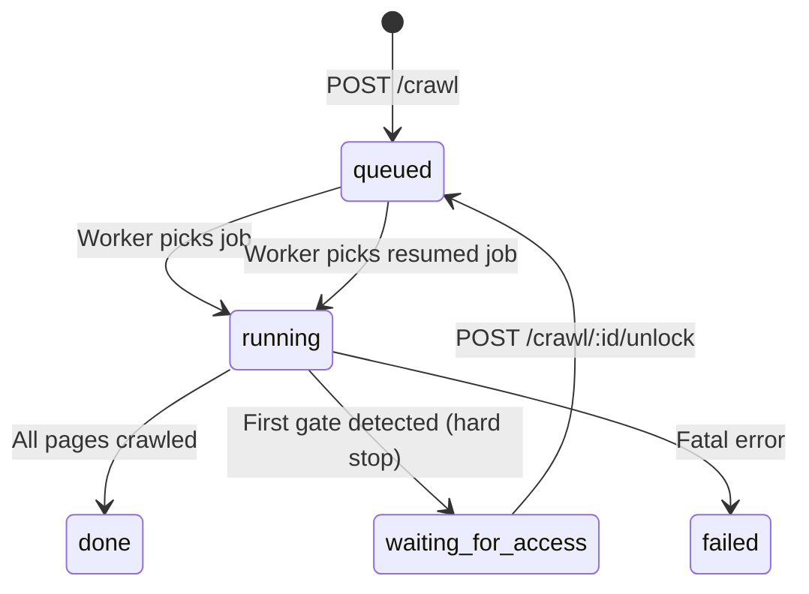

# WebGenome Crawler API Contract
> **Version:** G3.5 · **Commit:** `8eb71ce` · **Last Updated:** 2026-05-14

---

## 1. Crawl Lifecycle



### Status Definitions

| Status | Meaning | Terminal? |
|--------|---------|-----------|
| `queued` | Job is in BullMQ waiting for a worker | No |
| `running` | Worker is actively crawling pages | No |
| `done` | All reachable pages crawled, no gates hit | Yes |
| `waiting_for_access` | First gate detected, crawl paused, awaiting user unlock | No |
| `failed` | Unrecoverable error during crawl | Yes |

### Hard-Stop Semantics
When the worker detects a gate on **any** page:
1. Persists that single gated page (with `isGated: true`, `gateReason`, screenshot)
2. Sets `status: "waiting_for_access"`, records `blockedAtUrl` and `blockedReason`
3. **Breaks the crawl loop immediately** — no further pages are attempted
4. The pending queue is abandoned (not persisted)

### Resume Semantics
When a job is re-enqueued via `/unlock`:
1. Worker queries existing pages from DB
2. Successfully-crawled pages → `visited` set (skipped)
3. Previously-gated pages → `pending` queue (retried with new cookie)
4. `sessionCookie` injected into Playwright `BrowserContext` via `addCookies()`

---

## 2. API Endpoints

### `POST /crawl`
Submit a new crawl job.

**Request:**
```json
{ "url": "https://example.com", "maxPages": 10 }
```

**Response (202):**
```json
{ "crawlId": "crwl_a1b2c3d4", "status": "queued", "pollUrl": "/crawl/crwl_a1b2c3d4" }
```

**Errors:** `400` (invalid URL or maxPages), `503` (queue unavailable)

---

### `GET /crawl/:id`
Poll crawl status.

**Response (200):**
```json
{
  "crawlId": "crwl_a1b2c3d4",
  "siteUrl": "https://example.com",
  "status": "waiting_for_access",
  "maxPages": 10,
  "pagesTotal": 3,
  "pagesCrawled": 3,
  "blockedAtUrl": "https://example.com/dashboard",
  "blockedReason": "Cloudflare Challenge",
  "createdAt": "2026-05-14T...",
  "startedAt": "2026-05-14T..."
}
```

---

### `POST /crawl/:id/unlock`
Resume a gated crawl with a user-provided session token.

**Request:**
```json
{ "token": "cf_clearance=abc123def456..." }
```

**Behavior:**
1. Validates `token` is a non-empty string
2. Updates crawl status to `queued`
3. Enqueues a new BullMQ job with `sessionCookie` attached

**Response (202):**
```json
{ "status": "queued", "message": "Crawl resumed with provided access token." }
```

**Errors:**
| Code | Condition |
|------|-----------|
| `400` | Missing or non-string `token` |
| `404` | `crawlId` not found |
| `503` | Queue/Redis unavailable |

**Security Notes:**
- Token is stored only in the BullMQ job payload (transient)
- No validation of token format — any string is accepted
- Future: tie to authenticated user sessions (G4)

---

### `GET /crawl/:id/export`
Export crawl results in JSON, CSV, or HTML.

**Query Parameters:**

| Param | Values | Default |
|-------|--------|---------|
| `format` | `json`, `csv`, `html` | `json` |

**Allowed Statuses:** `done`, `waiting_for_access`
Other statuses return `202` with `{ error: "Crawl is not complete yet." }`

#### `format=json`
```json
{
  "crawlId": "crwl_...",
  "siteUrl": "https://...",
  "pages": 5,
  "elements": 142,
  "status": "ready",
  "data": [ { "url": "...", "title": "...", "elements": [...], "isGated": false } ]
}
```

#### `format=csv`
Flat file: one row per element across all pages.
Columns: `crawlId, url, title, tag, text, css, xpath, type, href`
Filename: `webgenome-crwl_xxx.csv`

#### `format=html`
Self-contained dark-themed HTML report with:
- Summary chips (pages, elements, status, blocked URL)
- Per-page sections with element tables
- GATED badges on blocked pages
Filename: `webgenome-crwl_xxx.html`

---

## 3. Gate Detection Heuristics

The worker checks pages in this order:

| Priority | Check | Gate Reason |
|----------|-------|-------------|
| 1 | `response.status() === 403 \|\| 429` | `HTTP 403` / `HTTP 429` |
| 2 | `page.title()` contains "Just a moment" or "Attention Required!" | `Cloudflare Challenge` |
| 3 | DOM contains `input[name="cf-turnstile-response"]` or `.cf-turnstile` | `Cloudflare Turnstile` |

---

## 4. Cookie Injection Rules

| Property | Value |
|----------|-------|
| Cookie name | `cf_clearance` |
| Domain | `new URL(siteUrl).hostname` |
| Path | `/` |
| Method | `BrowserContext.addCookies()` |

**Known Limitations:**
- Cloudflare clearance tokens are often bound to the originating IP + User-Agent
- The crawler runs on Railway with a fixed UA (`WebGenome-Crawler/0.1`)
- If the user solves from a different IP/UA, the token may be rejected on the server
- Tokens expire (typically 30 min to 24h depending on Cloudflare config)

---

## 5. Failure Cases

| Scenario | Behavior | User Message |
|----------|----------|--------------|
| Invalid token format | API returns 400 | "A valid string token must be provided." |
| Expired clearance | Resumed crawl hits gate again → re-enters `waiting_for_access` | Banner reappears |
| IP/UA mismatch | Same as expired — gate is re-triggered | Banner reappears |
| Token works but site has per-page auth | Some pages succeed, next gate triggers hard-stop again | New gate banner with updated count |
| User abandons unlock | Crawl stays in `waiting_for_access` indefinitely | No timeout currently (monitor threshold: 15 min) |
| Queue/Redis down | Unlock returns 503 | "Crawler service unavailable." |
